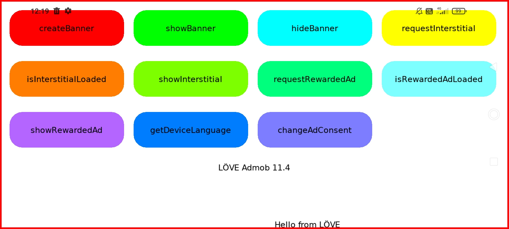
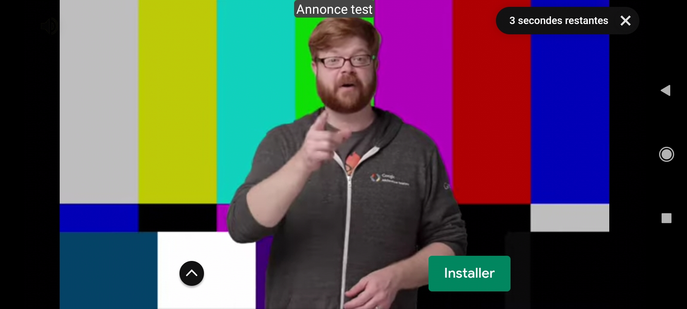

# love-android-extensions-assets

This repository serves as an example for the [love-android-extensions](https://github.com/flamendless/love-android-extensions) fork of [flamendless](https://github.com/flamendless) which integrates AdMob version 21.4.0 at [love-android](https://github.com/love2d/love-android). On this repository you can find an example in Lua as well as an APK file with this same example compiled with the latest version of the fork.

## Preview:

